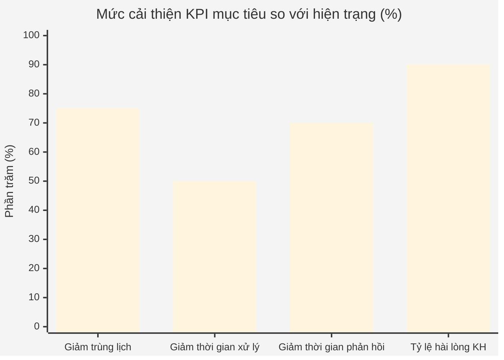
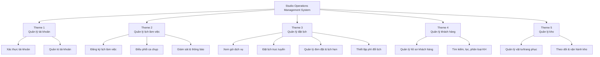
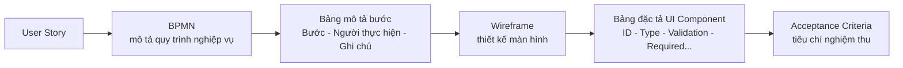
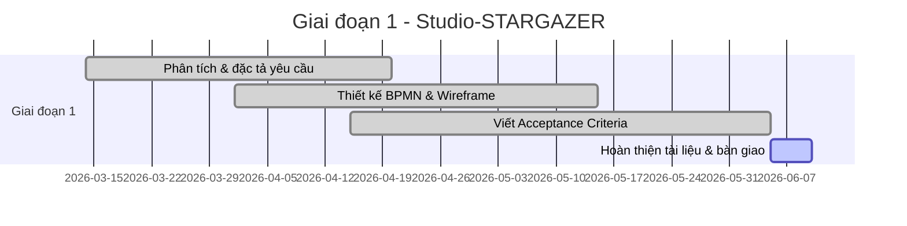

# 📸 Studio-STARGAZER — Studio Operations Management System

> Hệ thống quản lý vận hành studio chụp ảnh: đặt lịch, điều phối ca chụp, quản lý khách hàng & kho trang phục.

---

## 1. Giới thiệu dự án

**StarGazer** là studio chụp ảnh theo yêu cầu (chụp cá nhân, chụp đôi, gia đình, theo concept...), có dịch vụ hỗ trợ đi kèm (trang điểm, làm tóc, cho thuê trang phục/phụ kiện) và đội ngũ **13 nhân sự**.

Trước dự án, studio vận hành đặt lịch, quản lý khách hàng và quản lý kho theo cách **thủ công**, dẫn tới trùng lịch, sai sót điều phối và trải nghiệm khách hàng chưa tối ưu.

Dự án xây dựng **website/app quản lý vận hành studio**, tự động hoá toàn bộ quy trình đặt lịch – điều phối nhân sự – quản lý khách hàng – quản lý kho trang phục, giúp giảm sai sót và nâng cao trải nghiệm khách hàng.

**Vai trò của tôi:** Business Analyst — phân tích nghiệp vụ, viết tài liệu đặc tả yêu cầu và phối hợp với đội thiết kế/phát triển.

---

## 2. Mục tiêu kinh doanh (Giai đoạn 1: 14/03/2026 – 10/06/2026)

Mục tiêu chính của giai đoạn 1: triển khai hệ thống quản lý tập trung cho đặt lịch, xếp lịch, quản lý khách hàng và kho trang phục cơ bản.

| KPI | Trước dự án | Mục tiêu sau triển khai |
|---|---|---|
| 🗓️ Tỷ lệ trùng lịch | 20% | **< 5%** |
| 🗂️ Dữ liệu lịch đặt & khách hàng quản lý tập trung | Thủ công | **100%** trên hệ thống |
| ⏱️ Thời gian xử lý đơn đặt lịch | Baseline | Giảm **≥ 50%** |
| ⚡ Thời gian phản hồi & xác nhận lịch hẹn cho khách | Baseline | Giảm **≥ 70%** |
| ⭐ Tỷ lệ đánh giá tích cực của khách hàng | Baseline | **> 90%** |
| 👕 Quản lý kho trang phục theo concept & trạng thái | Chưa có | Triển khai đầy đủ |

**Biểu đồ mức độ cải thiện mục tiêu so với hiện trạng:**

---

## 3. Phạm vi dự án — 5 Theme nghiệp vụ chính

**Quy mô đặc tả:** 5 Theme → 12 Epic → **60+ User Stories**, mỗi User Story được đặc tả đầy đủ với Acceptance Criteria, BPMN và Wireframe.

---

## 4. Quy trình phân tích & thiết kế cho từng User Story

Với **mỗi User Story**, tôi thực hiện đầy đủ quy trình đặc tả theo chuẩn BA:

- **BPMN**: dựng trên **Bizagi Modeler**, mô tả luồng nghiệp vụ chi tiết theo từng vai trò (Sales, Makeup, Nhiếp ảnh, Kho, Khách hàng...).
- **Wireframe**: thiết kế trên **Figma** kết hợp **Google Stitch**.
- 🔗 Figma: [NHÓM04_GD Quản lí Studio](https://www.figma.com/design/0bH21FiMeBbusv4Vea8Hsp/NH%C3%93M04_GDQu%E1%BA%A3n-l%C3%AD-Studio?node-id=0-1&p=f&t=8xgcatpuyFoKZj6D-0)

---

## 5. Timeline dự án

---

## 6. 📁 Tài liệu dự án

| Tài liệu | Nội dung | File |
|---|---|---|
| 📄 Project Scope Statement (PSS) | Phạm vi, mục tiêu kinh doanh, giới thiệu dự án | [`Project Scope Statement (PSS).pdf`](./Project%20Scope%20Statement%20(PSS).pdf) |
| 📄 User Stories (US) | 60+ User Stories theo 5 Theme / 12 Epic | [`User Stories (US).pdf`](./User%20Stories%20(US).pdf) |
| 📄 Acceptance Criteria (AC) | BPMN + mô tả quy trình + Wireframe + đặc tả UI cho từng US | [`Acceptance Criteria (AC).pdf`](./Acceptance%20Criteria%20(AC).pdf) |
| 📊 Work Breakdown Structure (WBS) | Phân rã công việc, phân công thực hiện | [`Work Breakdown Structure (WBS).xlsx`](./Work%20Breakdown%20Structure%20(WBS).xlsx) |

---

## 7. 🛠️ Công cụ sử dụng

`Bizagi Modeler` · `Figma` · `Google Stitch` · `Microsoft Word` · `Microsoft Excel`

---

## 8. ✅ Kết quả đạt được

- Hoàn thành đặc tả nghiệp vụ đầy đủ cho **5 Theme / 12 Epic / 60+ User Stories**.
- Mỗi User Story có đầy đủ **BPMN – Wireframe – Acceptance Criteria**, sẵn sàng bàn giao cho đội phát triển.
- Xây dựng **Project Scope Statement** làm rõ mục tiêu kinh doanh, KPI đo lường theo từng giai đoạn.
- Thiết kế **Wireframe** đầy đủ toàn bộ luồng người dùng trên Figma.
- Xây dựng **WBS** phân rã công việc phục vụ lập kế hoạch & theo dõi tiến độ dự án.

---

## 9. 👩‍💻 Tác giả

**Đinh Thị Quỳnh Anh** — Business Analyst
