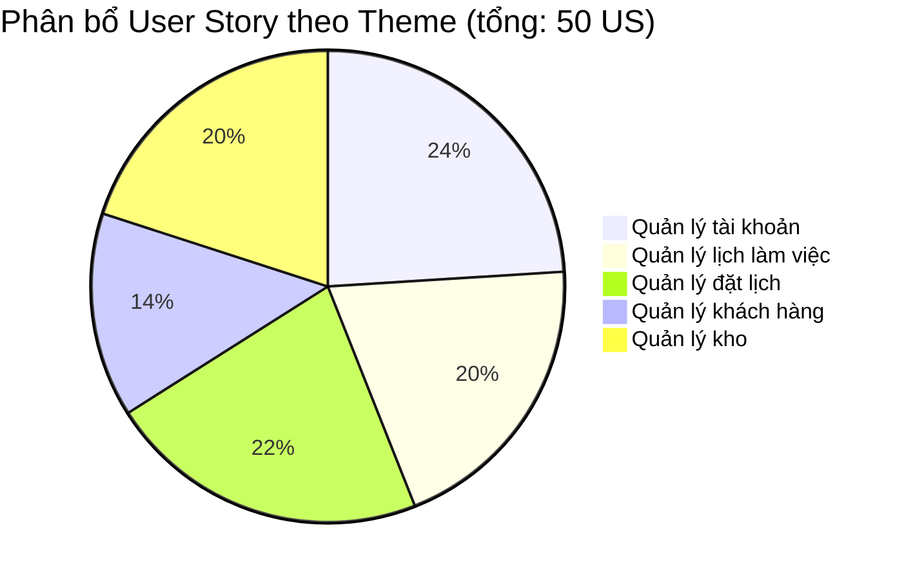
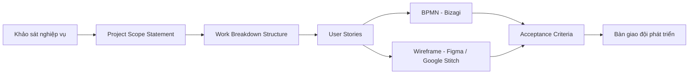

# 📸 Studio-STARGAZER — Hệ thống Quản lý Vận hành Studio Chụp Ảnh

> Dự án phân tích nghiệp vụ & thiết kế yêu cầu cho hệ thống quản lý vận hành **Studio chụp ảnh StarGazer** — từ khảo sát hiện trạng đến bộ tài liệu đặc tả hoàn chỉnh sẵn sàng chuyển giao cho đội phát triển.

---

## 🧭 Giới thiệu dự án

Studio StarGazer là đơn vị cung cấp dịch vụ chụp ảnh theo yêu cầu (cá nhân, đôi, gia đình, theo concept...) kèm các dịch vụ hỗ trợ như trang điểm, làm tóc, cho thuê trang phục. Với quy mô nhân sự 13 người và lượng khách hàng ổn định, studio đang gặp khó khăn trong việc quản lý lịch đặt, điều phối nhân sự và kho trang phục bằng phương pháp thủ công, dẫn đến tình trạng trùng lịch và chậm phản hồi khách hàng.

Dự án **Studio Operations Management System** được thực hiện nhằm phân tích, đặc tả và thiết kế một hệ thống website/app giúp số hóa toàn bộ quy trình vận hành: đặt lịch, quản lý khách hàng, quản lý kho trang phục và phối hợp giữa các bộ phận (Sales, Makeup, Nhiếp ảnh, Kho).

**Vai trò của tôi:** Business Analyst — chịu trách nhiệm khảo sát nghiệp vụ, viết Project Scope Statement, xây dựng WBS, đặc tả User Stories & Acceptance Criteria, mô hình hoá quy trình nghiệp vụ (BPMN) và phối hợp thiết kế wireframe.

---

## 🎯 Mục tiêu & chỉ số kỳ vọng (Giai đoạn 1: 14/03/2026 – 10/06/2026)

Các mục tiêu định lượng được đề ra trong Project Scope Statement làm cơ sở đo lường hiệu quả sau triển khai:

| Chỉ số | Hiện trạng | Mục tiêu kỳ vọng |
|---|---|---|
| Tỷ lệ trùng lịch đặt | ~20% | Giảm xuống dưới 5% |
| Quản lý tập trung lịch đặt & thông tin khách hàng | Thủ công | 100% dữ liệu quản lý trên hệ thống |
| Thời gian xử lý đơn đặt lịch | Baseline hiện tại | Giảm ≥ 50% |
| Thời gian phản hồi & xác nhận lịch cho khách | Baseline hiện tại | Giảm ≥ 70% |
| Tỷ lệ đánh giá tích cực của khách hàng | Chưa đo lường | Đạt trên 90% |

```mermaid
xychart-beta
    title "Mục tiêu cải thiện theo chỉ số vận hành (%)"
    x-axis ["Trùng lịch", "Thời gian xử lý đơn", "Thời gian phản hồi", "Hài lòng KH"]
    y-axis "Phần trăm (%)" 0 --> 100
    bar "Hiện trạng" [20, 100, 100, 0]
    bar "Mục tiêu" [5, 50, 30, 90]
```

---

## 🗂️ Phạm vi dự án — cấu trúc yêu cầu

Yêu cầu hệ thống được phân rã theo mô hình **Theme → Epic → User Story**, bao phủ 5 nhóm nghiệp vụ chính với tổng cộng **13 Epic** và **50 User Story**, mỗi User Story được đặc tả đầy đủ Acceptance Criteria, BPMN và Wireframe tương ứng.

| Theme | Epic | Số User Story |
|---|---|---|
| 1. Quản lý tài khoản | Xác thực tài khoản; Quản trị tài khoản | 12 |
| 2. Quản lý lịch làm việc | Đăng ký lịch; Điều phối ca chụp; Giám sát & thông báo | 10 |
| 3. Quản lý đặt lịch | Xem gói dịch vụ; Đặt lịch trực tuyến; Quản lý đơn đặt & lịch hẹn; Thiết lập phí đổi lịch | 11 |
| 4. Quản lý khách hàng | Quản lý hồ sơ khách hàng; Tìm kiếm/lọc/phân loại khách hàng | 7 |
| 5. Quản lý kho | Quản lý vật tư; Theo dõi & vận hành kho | 10 |

---

## 🔧 Quy trình thực hiện & công cụ sử dụng

- **Mô hình hoá quy trình nghiệp vụ:** BPMN dựng trên **Bizagi Modeler**, kèm bảng mô tả chi tiết Bước – Mô tả – Người thực hiện – Ghi chú cho từng luồng xử lý.
- **Thiết kế giao diện:** Wireframe thực hiện trên **Figma** kết hợp **Google Stitch**, mô tả rõ từng thành phần giao diện (ID, loại component, ràng buộc validate, khả năng chỉnh sửa, bắt buộc/không bắt buộc).
- **Đặc tả yêu cầu:** Mỗi User Story được tài liệu hoá thành Acceptance Criteria đầy đủ — tổng cộng bộ tài liệu AC dài **407 trang**, đảm bảo đội phát triển có đủ căn cứ để triển khai và kiểm thử.

---

## 📁 Tài liệu bàn giao trong repository

| Tài liệu | Nội dung |
|---|---|
| [`Project Scope Statement (PSS).pdf`](./Project%20Scope%20Statement%20(PSS).pdf) | Phạm vi dự án, mục tiêu kinh doanh, chỉ số KPI kỳ vọng theo từng giai đoạn |
| [`Work Breakdown Structure (WBS).xlsx`](./Work%20Breakdown%20Structure%20(WBS).xlsx) | Phân rã công việc theo chức năng của hệ thống |
| [`User Stories (US).pdf`](./User%20Stories%20(US).pdf) | 50 User Story theo cấu trúc Theme – Epic |
| [`Acceptance Criteria (AC).pdf`](./Acceptance%20Criteria%20(AC).pdf) | Đặc tả chi tiết tiêu chí chấp nhận, BPMN và wireframe cho từng User Story (407 trang) |

🔗 **Thiết kế wireframe (Figma):** [Xem tại đây](https://www.figma.com/design/0bH21FiMeBbusv4Vea8Hsp/NH%C3%93M04_GDQu%E1%BA%A3n-l%C3%AD-Studio?node-id=0-1&p=f&t=8xgcatpuyFoKZj6D-0)

---

## 💡 Kết quả đầu ra

- Bộ tài liệu đặc tả yêu cầu hoàn chỉnh, nhất quán từ Scope → WBS → User Story → BPMN → Wireframe → Acceptance Criteria, sẵn sàng chuyển giao cho đội phát triển.
- Chuẩn hoá quy trình nghiệp vụ của 4 bộ phận (Sales, Makeup, Nhiếp ảnh, Kho) thành các luồng BPMN rõ ràng, làm cơ sở tự động hoá.
- Bộ chỉ số KPI đo lường hiệu quả rõ ràng, làm căn cứ đánh giá thành công dự án sau khi triển khai giai đoạn 1.

---

*Dự án thực hiện bởi nhóm 04 — phần đóng góp Business Analyst: Đinh Thị Quỳnh Anh.*
